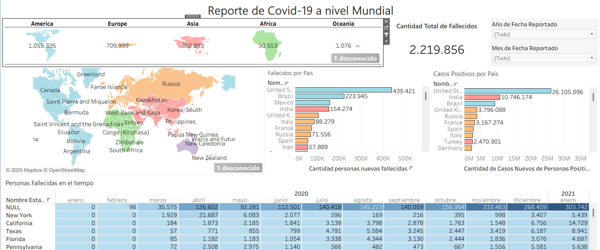
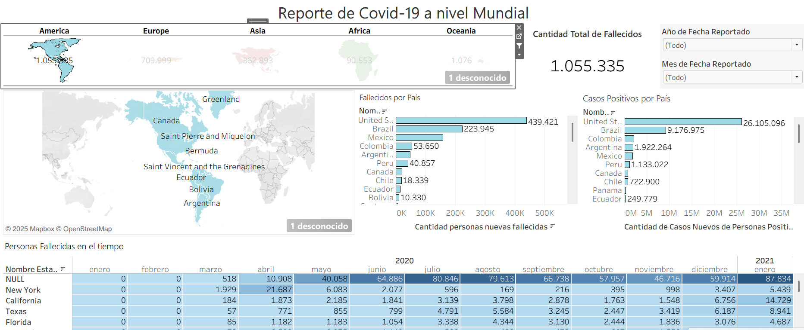
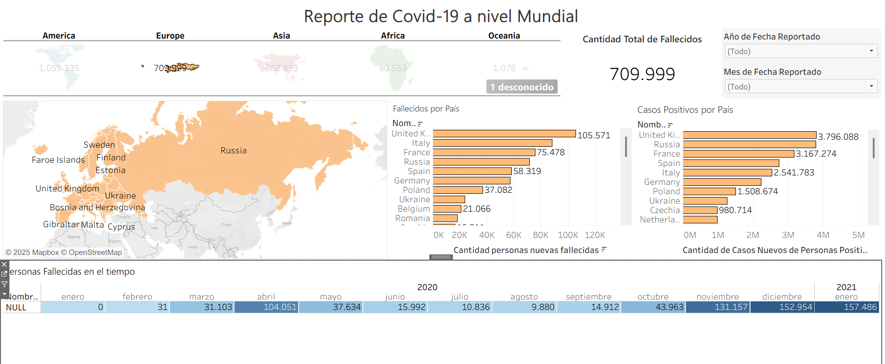
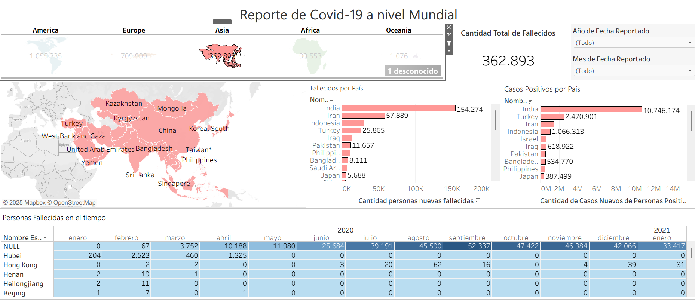
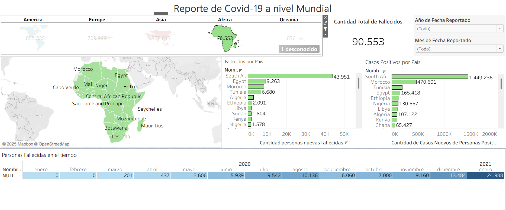
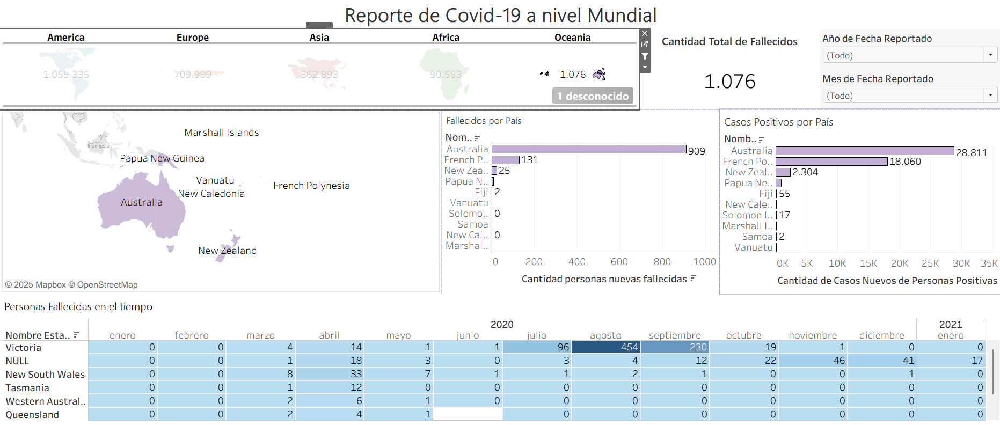

# 🌍 Dashboard COVID-19 a Nivel Mundial

Este proyecto tiene como objetivo visualizar el impacto global del COVID-19 mediante un dashboard interactivo desarrollado en Tableau, utilizando datos recopilados de los años **2020** y **2021**.

---

## 🎯 Objetivo

Desarrollar un dashboard que permita explorar la cantidad de personas **fallecidas y contagiadas por COVID-19** a lo largo del tiempo, desglosado por continentes, países y regiones específicas.

---

## 📊 Visualizaciones incluidas

El dashboard incluye múltiples vistas para facilitar el análisis comparativo y temporal de los datos:

### 🌐 A nivel global
- **Total mundial de fallecidos por COVID-19**
- **Total de casos positivos por país**

### 🗺️ Por continente
- Cantidad de **personas fallecidas por continente**
- Mapa interactivo con el **total de fallecidos por país dentro del continente**
- **Casos positivos por país** dentro del continente

### 📌 Por país y región
- Ranking de **países con mayor cantidad de fallecidos**
- Ranking de **países con mayor cantidad de casos positivos**
- Visualización por región/estado (ej. New York, Hubei, Victoria)

### ⏳ Evolución temporal
- Tabla de **personas fallecidas por mes y año (2020 - 2021)**, desglosada por región
- Evolución de los fallecimientos acumulados a lo largo del tiempo

---

## 🛠️ Herramientas utilizadas

- **Tableau Desktop** (visualización y análisis)
- **Excel / CSV** como fuente de datos
- **Mapbox + Tableau** para visualización geográfica

---

## 📁 Dataset

El dataset original contiene los siguientes campos relevantes:

- `Continente`
- `País`
- `Región/Estado`
- `Año`, `Mes`
- `Cantidad de personas fallecidas`
- `Cantidad de personas positivas`

📌 **Descarga directa del archivo CSV (Google Drive)**:  
[COVID-19 Cases.csv](https://drive.google.com/file/d/11sLPVT_-UXytPH--MJePJIMXBulueefZ/view?usp=sharing)

> Fuente de datos: Datos extraídos de registros abiertos de salud pública (puede actualizarse para vincular fuentes como [Our World in Data](https://ourworldindata.org/covid-deaths), OMS o bases oficiales nacionales).

---

## 🧭 Navegación del Dashboard

El dashboard principal permite la interacción por filtros:
- Selección de **continente** (América, Europa, Asia, África, Oceanía)
- Filtro por **año** y **mes**
- Exploración detallada por mapa y gráficos de barra

---

## 📈 Principales Insights

- **América** fue el continente con mayor cantidad de fallecidos (más de 1 millón).
- **Estados Unidos** y **Brasil** figuran entre los países con más muertes y casos positivos.
- **India** se destaca por la mayor cantidad de casos positivos en Asia.
- Se observan picos de mortalidad en los meses de **mayo a enero** tanto en 2020 como en 2021, con variaciones regionales.
- En **Oceanía** y **África**, los valores absolutos son mucho menores, pero muestran tendencias consistentes.

---

## 📸 Capturas del Dashboard

A continuación se muestran algunas vistas incluidas en el dashboard:

### Vista por América

### Vista por Europa

### Vista por Asia

### Vista por África

### Vista por Oceanía

> Las imágenes pueden encontrarse en la carpeta `/imagenes/` del repositorio.

---

## 🧩 Posibles mejoras futuras

- Agregar tasa de mortalidad por cada 100 mil habitantes
- Incluir datos de vacunación
- Incorporar predicciones con modelos de series temporales
- Hacer el dashboard público en Tableau Public o incrustado en una web personal

---

## 📌 Cómo visualizar el proyecto

Puedes descargar el archivo `.twbx` desde el repositorio y abrirlo con Tableau Desktop o Tableau Public.

---

## 📄 Licencia

Este proyecto es de libre uso con fines educativos y de análisis. Si lo reutilizas, se agradece atribución.
